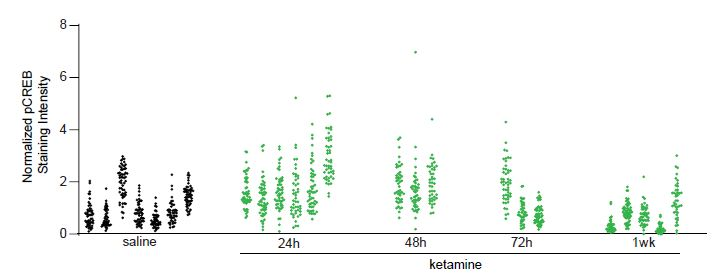
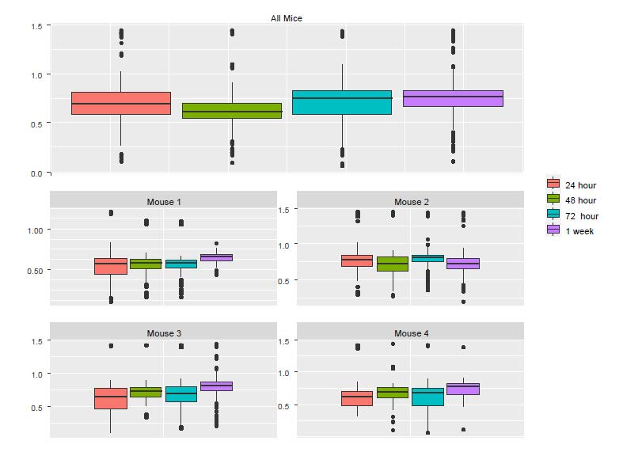

```{r setup, include=FALSE}
knitr::opts_chunk$set(echo = TRUE)
library("dplyr") #a library provides convenient data manipulation
library(ICC) #load the library to conduct ICC analysis with its function ICCbare
library(nlme) #load the nlme library
library(ggplot2)
library(gridExtra)
library("vioplot") #note, you will receive an error message if the package was not installed

```


## Learning Objectives

-   Motivating Example \vspace{0.3cm}  
-   LM, LME, GLM, and GLMM \vspace{0.3cm}
-   LME Examples: Examples 1 - 3 \vspace{0.3cm}
-   Generalized Linear Mixed-Effects Model (GLMM): Example 4 \vspace{0.3cm}
-   The slides are based on my published work:
    <https://doi.org/10.1016/j.neuron.2021.10.030>
    <https://yu-zhaoxia.github.io/MM_in_Neuroscience/>


# Motivating Example


## Example 1: Data
- 1200 neurons from 24 mice; 5 conditions/groups

```{r, echo=FALSE, out.width="90%"}

```

## Example 1: Data
\tiny
```{r}
Ex1=read.csv("https://www.ics.uci.edu/~zhaoxia/Data/BeyondTandANOVA/Example1.txt", head=T)

#Do not forget to factor the treatment IDs and animal IDs
#This is particularly important for the treatment_idx, 
#else the values will be treated as numerical values, rather than levels
Ex1$treatment_idx = as.factor(Ex1$treatment_idx)
Ex1$midx = as.factor(Ex1$midx)
head(Ex1)
```
\normalsize

## Example 1: Data Visualization
- boxplots by R base graphics 

\tiny
```{r, eval=FALSE}
#Use base graphics 
mycolors=rep(1:5, c(7,6,3,3,5)) #different colors for different treatment groups

#a basic plot of boxplots by mice
#Mice in the same treatment groups use the same color
boxplot(res~midx, data=Ex1, col=mycolors, xaxt="n")
axis(1, at = 1+c(1, 8, 14, 17, 20),
     labels = c("baseline", "24h", "48h", "72h", "1wk"))

#boxplot with jitter
boxplot(res~midx, data=Ex1, col=0, xaxt="n")
axis(1, at = 1+c(1, 8, 14, 17, 20),
     labels = c("baseline", "24h", "48h", "72h", "1wk"))
stripchart(res ~ midx, vertical = TRUE, data = Ex1, 
           method = "jitter", add = TRUE, pch = 20, col = mycolors)
```
\normalsize

## 
```{r, echo=FALSE}
#Use base graphics 
mycolors=rep(1:5, c(7,6,3,3,5)) #different colors for different treatment groups

#a basic plot of boxplots by mice
#Mice in the same treatment groups use the same color
par(mfrow=c(2,1))
boxplot(res~midx, data=Ex1, col=mycolors, xaxt="n")
axis(1, at = 1+c(1, 8, 14, 17, 20),
     labels = c("baseline", "24h", "48h", "72h", "1wk"))

#boxplot with jitter
boxplot(res~midx, data=Ex1, col=0, xaxt="n")
axis(1, at = 1+c(1, 8, 14, 17, 20),
     labels = c("baseline", "24h", "48h", "72h", "1wk"))
stripchart(res ~ midx, vertical = TRUE, data = Ex1, 
           method = "jitter", add = TRUE, pch = 20, col = mycolors)
```

## Violin plots generated by the vioplot package

\tiny
```{r, eval=FALSE}
par(mfrow=c(2,1)) #split the plot window to two vertically-stacked ones
vioplot(res~midx, data=Ex1, col=mycolors, xaxt = "n")
axis(1, at = 1+c(1, 8, 14, 17, 20),
     labels = c("baseline", "24h", "48h", "72h", "1wk"))

#violin plot with jitters
vioplot(res~midx, data=Ex1, col=0, xaxt="n")
stripchart(res ~ midx, vertical = TRUE, data = Ex1, 
           method = "jitter", add = TRUE, pch = 20, col = mycolors)
axis(1, at = 1+c(1, 8, 14, 17, 20),
     labels = c("baseline", "24h", "48h", "72h", "1wk"))
```
\normalsize

## 
```{r, echo=FALSE}
par(mfrow=c(2,1)) #split the plot window to two vertically-stacked ones
vioplot(res~midx, data=Ex1, col=mycolors, xaxt = "n")
axis(1, at = 1+c(1, 8, 14, 17, 20),
     labels = c("baseline", "24h", "48h", "72h", "1wk"))

#violin plot with jitters
vioplot(res~midx, data=Ex1, col=0, xaxt="n")
stripchart(res ~ midx, vertical = TRUE, data = Ex1, 
           method = "jitter", add = TRUE, pch = 20, col = mycolors)
axis(1, at = 1+c(1, 8, 14, 17, 20),
     labels = c("baseline", "24h", "48h", "72h", "1wk"))
```


## Fancy plots generated by ggplot2 package

\tiny
```{r, eval=FALSE}

plot1=ggplot(Ex1, aes(x = midx, y = res, fill=treatment_idx)) + 
  geom_violin()
#boxplot within violin plot
plot2=ggplot(Ex1, aes(x = midx, y = res, fill=treatment_idx)) + 
  geom_violin()+
  geom_boxplot(width=0.1)
grid.arrange(plot1, plot2, ncol=1, nrow=2)#library(gridExtra)
```
\normalsize

## 
```{r, echo=FALSE}

plot1=ggplot(Ex1, aes(x = midx, y = res, fill=treatment_idx)) + 
  geom_violin()
#boxplot within violin plot
plot2=ggplot(Ex1, aes(x = midx, y = res, fill=treatment_idx)) + 
  geom_violin()+
  geom_boxplot(width=0.1)
grid.arrange(plot1, plot2, ncol=1, nrow=2)#library(gridExtra)
```

## Example 1: The "Familiar" Analysis

\tiny
```{r}
summary(aov(res~treatment_idx, data=Ex1))
summary(lm(res~treatment_idx, data=Ex1))
```
\normalsize


## Example 1: The "Familiar" Approach for Null Data 

-    Is the familiar approach valid? We evaluate the method using data generated under the \textcolor{red}{null} hypothesis \vspace{0.3cm}

-    We can generate a null data set by permuting the treatment group labels of the animals  \vspace{0.3cm}

-    We generate 1000 null data sets and check how many times the familiar approach will reject the null hypothesis of no group difference


## Example 1: The "Familiar" Approach for Null Data 

\tiny
```{r}
treatment=as.factor(rep(1:5, c(7,6,3,3,5)))
ncell=sapply(split(Ex1, Ex1$midx), dim)[1,]
#generate pseudo (permuted) 1000 times by randomly 
#shuffling the treatment labels across mice
pvalues=rep(NA, 1000)#initialize a vector of p-values
for(i in 1:1000) {
  Ex1.perm = data.frame(res=Ex1$res, 
                        treatment_idx=rep(sample(treatment),ncell), midx=Ex1$midx)
  pvalues[i]=anova(lm(res~treatment_idx, data=Ex1.perm))$"Pr(>F)"[1] }
```
\normalsize


## Example 1: P-values using 1000 Null Data sets
- What does the histogram suggest?

\tiny
```{r, out.width="60%"}
hist(pvalues)
```
\normalsize


## Why does LM fail for Example 1?
- This because the observations are not independent
- We can compute Intra-Class Correlation (ICC) to quantify the magnitude of clustering due to animal effects.

\tiny

```{r, echo=FALSE}
### conduct ICC analysis by organizing all the information into a data frame
icc.analysis=data.frame(n=rep(0,5), icc=rep(0,5), design.effect=rep(0,5),
effective.n=rep(0,5), M=rep(0,5), cells=rep(0,5))
for(i in 1:5){
    trt= Ex1[Ex1$treatment_idx==i,]
    trt$midx=factor(trt$midx)
    icc=ICCbare(factor(trt$midx), trt$res) #ICCbare is a function in the ICC package
    icc.analysis$cells[i]=dim(trt)[1]
    M=dim(trt)[1]/length(unique( trt$midx))
    def=1 + icc*(M-1)
    icc.analysis$n[i]=length(unique( trt$midx))
    icc.analysis$icc[i]=icc
    icc.analysis$design.effect[i]=def
    icc.analysis$effective.n[i]=dim(trt)[1]/def
    icc.analysis$M[i]=M
}
```
\normalsize

\tiny
```{r, echo=FALSE}
tmp=t(icc.analysis[,c(6,2)])
row.names(tmp)= c("# of cells", "ICC")
knitr::kable(tmp, col.names = c("Saline (7 mice)","24h (6 mice)","48h (3 mice)",
                                "72h (3 mice)","1wk (5 mice)"))
```
\normalsize 

```{r, echo=FALSE, out.width="50%"}

```


## ICC Analysis of Example 1
- The ICC indicates that the dependency due to clustering is substantial. 
- Therefore, the 1,200 neurons should not be treated as 1,200 independent cells. 
- When dependence is not adequately accounted for, the type I error rate can be much higher than the pre-chosen level of significance. 


# From LM to LME 

## LM (\textcolor{red}{incorrect!}) for Example 1
- Consider Example 1. Let 
  - $Y_{ij}$ indicate the $j$th observed response of the $i$th mouse.
  - $x_{ij}$ be the treatment label, with $x_{ij}=1$ for baseline, $x_{ij}=2$ for 24 hours, $x_{ij}=3$ for 48 hours, $x_{ij}=4$ for 72 hours, and $x_{ij}=5$ for 1 week after ketamine treatments. 
- In the inner mathematical computation, four dummy variables, which take value 0 or 1, are generated: $x_{ij,1} = 1$ for 24 hours, $x_{ij,2} = 1$ for 48 hours, $x_{ij,3} = 1$ for 72 hours, and $x_{ij,4} = 1$ for 1 week after ketamine treatments, respectively.

\tiny

$$\begin{aligned}
Y_{ij} &= \beta_0 + x_{ij,1}\beta_1 + … + x_{ij,4}\beta_4 + \epsilon_{ij}, \\
& i=1, …, 24; j=1, …, n_i;\end{aligned}$$
where $n_i$ is the number of observations from the $i$th mouse. 
\normalsize

## LME for Example 1

- The 1200 observations are \textcolor{red}{clustered} by animal. We account for the resulting \textcolor{red}{dependence} by adding an animal specific effect, as follows:
$$\begin{aligned}
Y_{ij} &= \beta_0 + x_{ij,1}\beta_1 + … + x_{ij,4}\beta_4 + u_i + \epsilon_{ij}, \\
& i=1, …, 24; j=1, …, n_i;
\end{aligned}$$
where

\tiny

  - $u_i$ indicates the deviance between the overall intercept $\beta_0$ and the mean specific to the $i$th mouse
  - $\epsilon_{ij}$ represents the deviation in pCREB immunoreactivity of observation (cell) $j$ in mouse $i$ from the mean pCREB immunoreactivity of mouse i
  - ($\beta_0, \beta_1, \beta_2, \beta_3, \beta_4$) are assumed to be \textcolor{red}{fixed} but unknown
  - ($u_1, \cdots, u_{24}$) are treated as independent and identically distributed \textcolor{red}{random} variables from a normal distribution with mean 0 and a variance parameter that reflects the variation across animals. 

\normalsize


## LME for Example 1

- Similar to the treatment variable, for the animal ID variable, the users do not need to define the dummy variables, which are generated by R automatically in its inner working. 

- Thus, equivalently, one could write the previous equation by using a vector ($z_{ij,1}, …, z_{ij,24}$) of dummy variables for the cluster/animal memberships such that $z_{ij,k}=1$ for $i=k$ and 0 otherwise:

$$\begin{aligned}
Y_{ij} &= \beta_0 + x_{ij,1}\beta_1 + … + x_{ij,4}\beta_4 + z_{ij,1}u_1 + … + z_{ij,24}u_{24} + \epsilon_{ij},\\
& i =1, …, 24; j=1, …, n_i;
\end{aligned}$$

## LME for Example 1
- $Y_{ij}$ is modeled by three components: 
  - the fixed-effects from the covariates ($x_{xij,1}, …, x_{ij,4}$) and the overall intercept $\beta_0$, which is the population mean of the reference group in this example
  - the random-effects due to the clustering ($z_{ij,1}, …, z_{ij,24}$)
  - the random errors $\epsilon_{ij}$’s

## R Packages for LME
- Two major packages are 'nlme' and 'lme4'. 
- Syntax:
  - 'nlme::lme(res~treatment_idx, data= Ex1, random = ~ 1|midx)'
  - 'lme4::lmer(res ~ treatment_idx+(1|midx), data=Ex1)'
- Note that, similar to the fixed effects, for the random-effects, we don’t need to created the dummy variables. This will be done internally by R.
- For the fixed-effects (treatment_idxhere), make sure that it is a factor, not numerical, as the levels “1-5” denote different times points
- For the random-effects from “midx”(mice), R treated it as a factor with different levels (animals)


# LM, LME, GLM, and GLMM


## LM and LME: Matrix Format

-   LM: \textcolor{red}{$Y=X\beta + \mathbf\epsilon$}
    -   a linear predictor $X\beta$
    -   random errors $\mathbf \epsilon$ are independent, have a zero
        mean and a constant variance.
    -   $\mathbf \epsilon \sim N(0, \sigma^2 \mathbf I)$ is used for
        deriving t- and F-tests. Typically this assumption is not very
        critical as long as the sample size is not too small
-   LME:
    \textcolor{red}{$Y=X\beta + Z\mathbf u + \mathbf\epsilon$}
    -   fixed-effects: a linear predictor $X\beta$
    -   random-effects: $Z\mathbf u$, where $\mathbf u\sim N(0, G)$.
        E.g., $G=\sigma_b^2 \mathbf I$.
    -   random errors: $\mathbf \epsilon \sim N(0, \sigma^2 \mathbf I)$,
        independent with $\mathbf u$.

## GLM and GLMM

-   The components of GLM:
    -   a linear predictor $X\beta$
    -   a link function to connect $E(Y|X)$ and $X\beta$:
        \textcolor{red}{$g(E(Y|X))=X\beta$}
    -   a distribution for $Y$ given $E(Y|X)$
-   The components of GLMM:
    -   fixed-effects: a linear predictor $X\beta$
    -   random-effects: $Z\mathbf u$, where $\mathbf u\sim N(0, G)$.
        E.g., $G=\sigma_b^2 \mathbf I$.
    -   a link function to connect $E(Y|X, \mathbf u)$ and $X\beta$:
        \textcolor{red}{$g(E(Y|X, \mathbf u))=X\beta + Z\mathbf u$}
    -   a distribution for $Y$ given $E(Y|X)$


# LME Examples: Example 1
## LME Examples: Example 2

\tiny
```{r}
# The nlme:lme function specifies the fixed effects in the formula
# (first argument) of the function, and the random effects
# as an optional argument (random=). The vertical bar | denotes that
# the cluster is done through the animal id (midx)
obj.lme=lme(res~treatment_idx, data= Ex1, random = ~ 1|midx, method="ML")
summary(obj.lme)$tTable
```
\normalsize

- The results from LME is more realistic


##

\tiny
```{r}
summary(obj.lme)

```
\normalsize


##

\tiny
```{r}
anova(obj.lme)

```
\normalsize


# LME Examples: Example 2

## LME Examples: Example 2

-   Research question: determine how in vivo calcium (Ca++) activity of
    PV cells (measured longitudinally by the genetically encoded Ca++
    indicator GCaMP6s) changes over time after ketamine treatment
-   Study: Ca++ event frequencies were measured at 24h, 48h, 72h, and 1
    week after ketamine treatment in four mice
-   Want to compare Ca++ event frequency at 24h to the other three time
    points.
-   In total, Ca++ event frequencies of 1,724 neurons were measured.


## Example 2: Data

\tiny
```{r, message=FALSE, warning=FALSE}
library(nlme)
library(lme4)
library(lmerTest)
Ex2=read.csv("https://www.ics.uci.edu/~zhaoxia/Data/BeyondTandANOVA/Example2.txt", head=T)
Ex2$treatment_idx=Ex2$treatment_idx-4
Ex2$treatment_idx=as.factor(Ex2$treatment_idx)
### covert the variable of mouse IDs to a factor
Ex2$midx=as.factor(Ex2$midx)
```
\normalsize


## Example 2: Wrong analysis

\tiny
```{r}
lm.obj=lm(res~treatment_idx, data=Ex2)
summary(lm.obj)$coefficients
```
\normalsize

## Example 2: Wrong analysis

-   The LM (including ANOVA, t-test) analysis results indicate
    -   significantly reduced Ca++ activity at 48h relative to 24h with
        $p=4.8\times 10^{-6}$\
    -   significantly increased Ca++ activity at 1week compared to 24h
        with $p=2.4\times 10^{-3}$
    -   However, if we account for repeated measures due to cells
        clustered in mice using LME, the changes are no longer
        significant

## Example 2: LME

\tiny
```{r}
lmer.obj=lmerTest::lmer(res~treatment_idx+(1|midx), data= Ex2, REML="FALSE")
summary(lmer.obj)$coefficients
```
\normalsize


## Example 2: LM vs LME

Estimated changes of Ca+ event frequency (the baseline is 24h after
treatment)

```{=latex}
\begin{tabular}{cccc}
& 48h & 72h & 1wk \\ \hline
LM est   &-0.078 $\pm$.017 &    0.009$\pm$0.017 & 0.050$\pm$0.016\\ 
LM p &  $4.8\times 10^{-6}$ & 0.595 & $2.4\times 10^{-3}$   \\
LME est & -0.017$\pm$0.017  & 0.009$\pm$0.017   & 0.029$\pm$0.017   \\
LME p   & 0.311 & 0.573 & 0.076 
\end{tabular}
```
## Pooling data naively is not a good idea

```{r S2, out.width="72%", fig.cap="The boxplots of Ca++ event frequencies measured at four time points. (A) Boxplot of Ca++ event frequencies using the pooled neurons from four mice. (B) boxplots of Ca++ event frequencies stratified by individual mice.", echo=FALSE}

```

## Pooling data naively is not a good idea

-   Consider the change in Ca++ activities from 24h to 48h
-   Pooled data from all mice:
    -   The box plots suggest reduction in Ca++ activities
-   Individual mice data:
    -   The box plots of Mouse 2 suggest a noticeable reduction
    -   However, there was almost no change in Mouse 1
    -   Mouse 3 and Mouse 4 might suggest small increases, rather than
        decreases

## Pooling data naively is not a good idea

-   Why do the pooled data follow the pattern of Mouse 2?

```{r, message=FALSE, include=FALSE}
# the number of cells in each animal-time combination
table(Ex2$midx, Ex2$treatment_idx)
# compute the percent of cells contributed by each mouse
rowSums(table(Ex2$midx, Ex2$treatment_idx))/1724
```

```{=latex}
\begin{tabular}{cccccc}
& 24h & 48h & 72h & 1wk & Total\\ \hline
Mouse 1 & 81 & 254 &    88  & 43    & 466(27$\%$)\\
Mouse 2 & 206   & 101   & 210   & 222   & 739 (43$\%$)\\
Mouse 3 & 33    & 18    & 51    & 207   & 309 (18$\%$)\\
Mouse 4 & 63    & 52    & 58    & 37    & 210 (12$\%$)\\
Total   & 383   & 425   & 407   & 509   & 1,724 (100$\%$) 
\end{tabular}
```
-   Mouse 2 contributed 43% cells! \vspace{2cm}

## Remark: on the minimum number of levels for using random-effects

-   In Example 2, the number of levels in the random-effects variable is
    four, as there are four mice. \vspace{1cm}
-   According to Gelman and Hill 2006, it does not hurt to use
    random-effects in this situation. \vspace{1cm}
-   There is no unique answer on the minimum number of levels for using
    random-effects.

## Remark: on the minimum number of levels for using random-effects

-   An alternative is to include the animal ID variable as factor with
    fixed animal effects.
-   Neither of two approaches is the same as fitting an LM to the pooled
    cells naively.
-   In a more extreme case, for an experiment using only two monkeys for
    example,
    -   naively pooling data (such as neurons) is NOT recommended.
    -   a more appropriate approach is to analyze the animals separately
        and then check whether the results from the two animals are
        consistent

# LME Examples: Example 3

## Example 3: Data Structure

-   Ca++ event integrated amplitudes are compared between baseline and
    24h after ketamine treatment.

-   1244 cells were sampled from 11 mice

-   each cell was measured twice (baseline and after ketamine treatment)

-   correlation arises from both cells and animals, which creates a
    three-level structure:

    -   measurements within cells and cells within animals.

\tiny

```{R}
    library(nlme)
    library(lme4)
    library(lmerTest)
    Ex3=read.csv("https://www.ics.uci.edu/~zhaoxia/Data/BeyondTandANOVA/Example3.txt", head=T)
```
\normalsize


## Example 3: LM vs LME

\tiny
```{R, eval = FALSE,}
#### wrong analysis: using the linear model
summary(lm(res~treatment, data=Ex3[!is.na(Ex3$res),])) #0.0036
#### wrong analysis using t tests (paired or unpaired)
t.test(Ex3[Ex3$treatment==1,"res"], Ex3[Ex3$treatment==2,"res"], var.eq=T)
t.test(Ex3[Ex3$treatment==1,"res"], Ex3[Ex3$treatment==2,"res"])
t.test(Ex3[Ex3$treatment==1,"res"], Ex3[Ex3$treatment==2,"res"], paired=T)

#LME
lme.obj1=lme(res~ treatment, random =~1| midx/cidx, 
             data= Ex3[!is.na(Ex3$res),], method="ML")
summary(lme.obj1)
```
\normalsize


## Example 3: LM vs LME

-   LME and LM produce similar estimates for the fix-effects
    coefficients
-   the standard error of the LM is larger; the p-value based on LME is
    smaller (0.0036 for LM vs 0.0001 for LME).
-   In this example, since the two measures from each cell are
    positively correlated, the variance of the differences is smaller
    when treating the data as paired rather than independent.
-   As a result, LME produces a smaller p-value
-   \textcolor{red}{Rigorous statistical analysis is not a hunt for the smallest
    p value (commonly known as p-hacking or significance chasing)}

## 

```{R S3, echo=FALSE, out.width="100%", fig.cap="(Left) the scatter plot of Ca++ event integrated amplitude at baseline vs 24h after treatment for the neurons from four mice (labeled as 1, 2, 3 and 4) indicates that the baseline and after-treatment measures are positively correlated. (Right) boxplot of the baseline and after-treatment correlations of the 11 mice."}
knitr::include_graphics("Fig3S.png")
```

## A note on "nested" random effects

-   When specifying the nested random effects, we used "random =\~1\|
    midx/cidx".
-   This leads to random effects at two levels: the mouse level and the
    cells-within-mouse level.
-   This specification is important if same cell IDs might appear in
    different mice.
-   When each cell has its unique ID, just like "cidx" variable in
    Example 3, it does not matter and "random =list(midx=\~1, cidx=\~1)"
    leads to exactly the same model.

## A note on "nested" random effects

\tiny
```{R, eval = FALSE}
### to verify that the cell IDs are indeed unique
length(unique(Ex3$cidx))
#lme.obj2 is the same as lme.obj
lme.obj2=lme(res~ treatment, random =list(midx=~1, cidx=~1), data=Ex3[!is.na(Ex3$res),], method="ML")
summary(lme.obj2)
```
\normalsize

## On models with more random effects

-   The above LME model only involves random intercepts.
-   There might be random effects due to multiple sources.
-   A model with more random-effects might be a better choice.
-   Visualization is a useful exploratory tool to help identify an
    appropriate model.

## On models with more random effects

\tiny
```{R S4, echo=FALSE, out.width="90%", fig.cap="Ca++ event integrated amplitudes at baseline vs 24h after treatment for the neurons from four mice (labeled as A, B, C and D) with each dot representing a neuron. The four plots on the left are “spaghetti” plots of the four animals with each line representing the values at baseline and 24h after treatment for a neuron; the four plots on the right report the before-after scatter plots (with fitted straight lines using a simple linear regression)."}
knitr::include_graphics("Fig4S.png")
```
\normalsize

## Compare Models with Different Random Effects
- Skipped. See Example 3 of 
<https://yu-zhaoxia.github.io/MM_in_Neuroscience/>

```{r, echo=FALSE, eval=FALSE}
#mouse: random intercepts; neuron: both random intercepts and random slopes
#(independence not assumed)
lme.obj1=lme(res~ treatment, random =~1| midx/cidx, data= Ex3[!is.na(Ex3$res),], method="ML")
summary(lme.obj1)
lme.obj3=lme(res~ treatment, random=list(midx=~1, cidx=~treatment), data=
Ex3[!is.na(Ex3$res),], method="ML")
summary(lme.obj3)
anova(lme.obj1, lme.obj3)
#mouse: random intercepts and random slopes (independence not assumed); neuron: random intercepts
lme.obj4=lme(res~ treatment, random=list(midx=~treatment, cidx=~1), data= Ex3[!is.na(Ex3$res),], method="ML")
summary(lme.obj4)
#mouse: random intercepts and random slopes; neuron: random intercepts and random slopes
lme.obj5=lme(res~ treatment, random= ~ 1+treatment | midx/cidx, data= Ex3[!is.na(Ex3$res),], method="ML")
summary(lme.obj5)
anova(lme.obj1, lme.obj3)
anova(lme.obj1, lme.obj4)
anova(lme.obj3, lme.obj5)
```

## On models with more random effects

-   Tests can be used to compare models with different random effects
    -   Need to be careful. See 6.4 of
        <https://yu-zhaoxia.github.io/MM_in_Neuroscience/>
-   For example 3, the model I chose have the following random-effects:

"random=list(midx=\~1, cidx=\~treatment)"

-   It improves lme.obj1 substantially.

-   Adding more random-effects does not lead to further improvement

# GLMM: Example 4

## Generalized Linear Mixed-Effects Model (GLMM)

-   The components of aGLMM:
    -   fixed-effects: a linear predictor $X\beta$
    -   random-effects: $Z\mathbf u$, where $\mathbf u\sim N(0, G)$.
        E.g., $G=\sigma_b^2 \mathbf I$.
    -   a link function to connect $E(Y|X, \mathbf u)$ and $X\beta$:
        $$g(E(Y|X, \mathbf u))=X\beta + Z\mathbf u$$
    -   a distribution for $Y$

## GLMM Examples: A Simulated Data Set

-   The simulation used parameters estimated from real data
-   Eight mice were trained to do task
-   The behavior outcome is whether the animals make the correct
    predictions
    -   512 trials in total: 216 correct trials, 296 wrong trials
-   Mean neuronal activity levels (dF/F) were recorded for each trial
-   We would like to model behaviors using neuronal data (decoding)

## Use lme4::glmer to fit a GLMM

\tiny
```{R, warning=FALSE}
library(lme4) 
library(pbkrtest)
waterlick=read.table("https://www.ics.uci.edu/~zhaoxia/Data/BeyondTandANOVA/waterlick_sim.txt", head=T)
summary(waterlick)
#change the mouseID to a factor
waterlick[,1]=as.factor(waterlick[,1])
```
\normalsize


## Use lme4::glmer to fit a GLMM

\tiny
```{R}
obj.glmm=glmer(lick~dff+(1|mouseID),
data=waterlick,family="binomial")
#summary(obj.glmm)
#compute increase in odds and a 95% CI
exp(c(0.06235, 0.06235-1.96*0.01986, 0.06235+1.96*0.01986))-1
```
\normalsize

## Interpret GLMM results

-   The estimate of odd is 6.4% increase and a 95% confidence interval
    is 2.3% to 10.7%
-   The interpretation of the fixed effects for GLMM is complicated by
    both
    -   the random effects and
    -   non-linear link functions
-   Among typical mice, the odds of making correct licks increased by
    6.4% (95% C.I.: 2.4%-10.7%) with one unit increase in dF/F.

## LRT test

-   Likelihood ratio test can be done by comparing the model with and
    the model without the \`\`dff" variance (neuronal activity).
    Large-sample approximation is used.

\tiny
```{R, eval = FALSE}
#fit a smaller model, the model with the dff variable removed
obj.glmm.smaller=glmer(lick~(1|mouseID),
data=waterlick,family="binomial")
#use the anova function to compare the likelihoods of the two models
anova(obj.glmm, obj.glmm.smaller)
#alternatively, one can use the “drop1” function to test the effect of dfff
drop1(obj.glmm, test="Chisq")
```
\normalsize

## Improve accuracy of p-values

-   The large-sample approximations in GLMM might not be accurate
-   We show how to conduct a parametric bootstrap test

\tiny
```{R, eval = FALSE, cache=TRUE, message=FALSE, warning=FALSE}
#The code might take a few minutes
PBmodcomp(obj.glmm, obj.glmm.smaller)
```
\normalsize

-   By default, 1000 samples were generated to obtain an empirical null
    distribution of the likelihood ratio statistic

## Convergence Issues

-   GLMM is harder to converge than LME.
    -   Increase the number of iterations
    -   Switch to a different numerical maximization methods
    -   Modify models such as eliminate some random effects

<https://rstudio-pubs-static.s3.amazonaws.com/33653_57fc7b8e5d484c909b615d8633c01d51.html>

<https://bbolker.github.io/mixedmodels-misc/glmmFAQ.html>

<https://m-clark.github.io/posts/2020-03-16-convergence/>

## Convergence Issues

-   Consider more robust methods such generalized estimating equation
    (GEE) \vspace{1cm}
-   Oftentimes, Bayesian approaches are easier to converge
